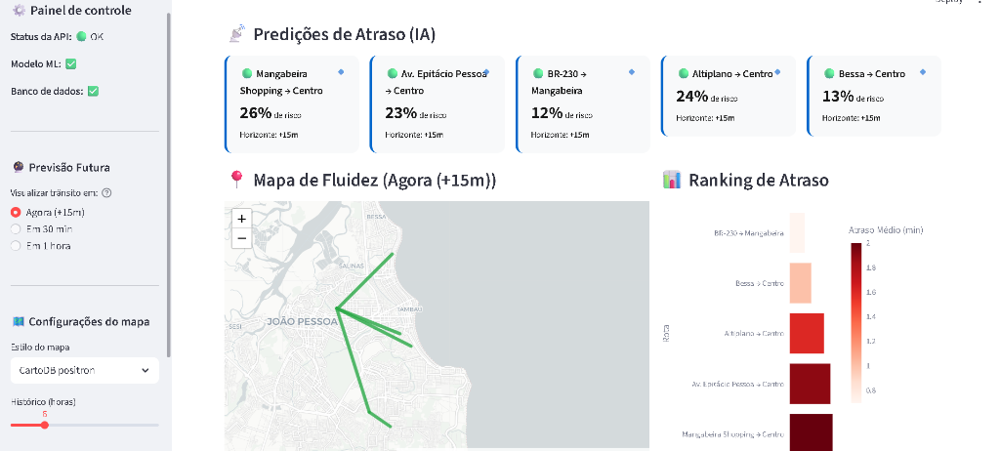
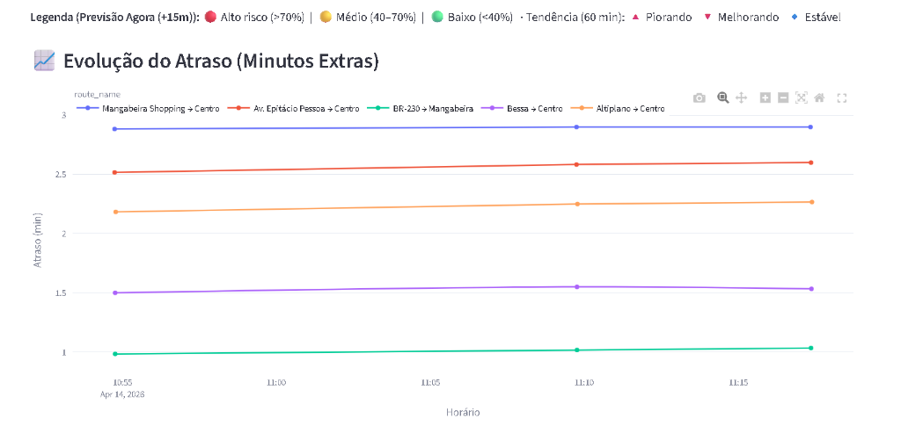
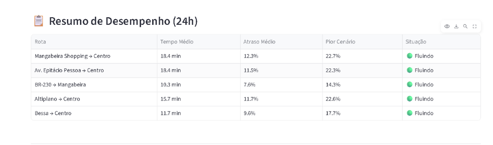
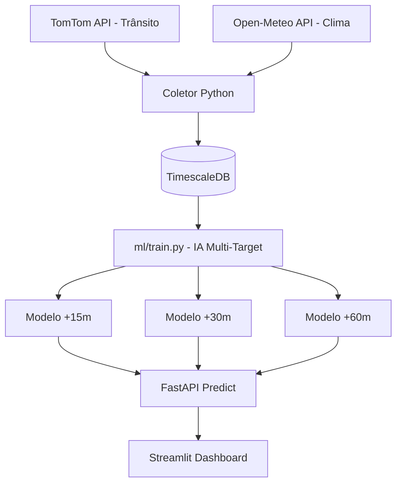
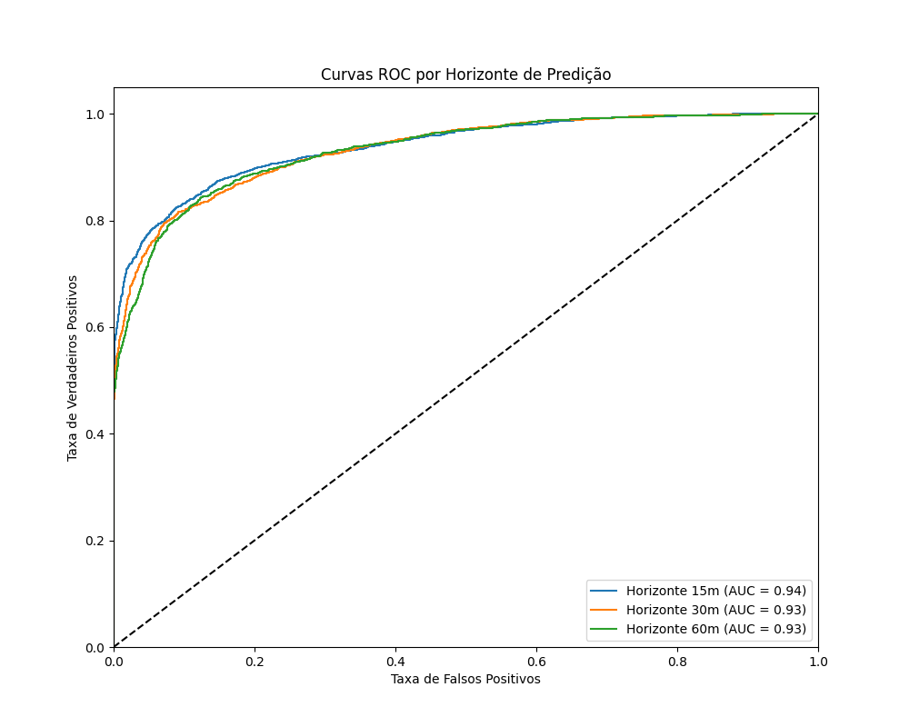
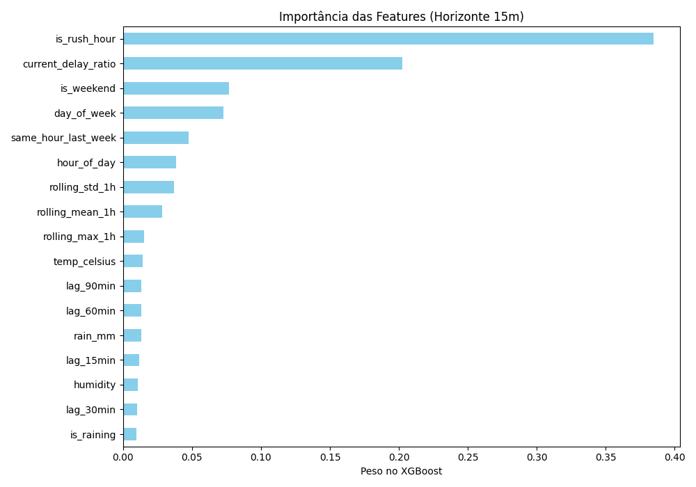

# 🚌 Mobilidade JP — Predictor

> Sistema de Inteligência Artificial para antecipar gargalos de tráfego em João Pessoa, PB.
> Este projeto utiliza a **TomTom Traffic API** para monitorar corredores críticos e modelos **XGBoost** para prever o trânsito com múltiplos horizontes de tempo (+15, +30 e +60 min).


---

## 📌 Visão Geral

O **Mobilidade JP** vai além de um simples mapa de trânsito em tempo real. Enquanto ferramentas como o Google Maps mostram onde o trânsito *está* ruim agora, nosso sistema utiliza aprendizado de máquina para prever **onde ele estará ruim nos próximos 60 minutos**, permitindo antecipar congestionamentos causados por horários de pico ou chuvas intensas.

### ✨ Principais Funcionalidades
- **🤖 Previsão Multi-Horizonte**: IA treinada para prever o risco de atraso em 15, 30 e 60 minutos.
- **📈 Análise de Tendência**: Indicadores visuais que mostram se o trânsito está com tendência de piorar (🔺) ou melhorar (🔻).
- **🔮 Mapa do Futuro**: Controle deslizante que altera todo o visual da cidade para o estado projetado pela IA.
- **⚡ Monitoramento Real**: Integração direta com a API da TomTom e Open-Meteo (Clima).

---

## 🖼️ Demonstração

### Visão Geral do Dashboard


### Evolução do Atraso (Histórico)


### Resumo de Desempenho (24h)


## 🏗️ Arquitetura do Sistema



---

## 🔌 APIs Consumidas

O sistema integra dados de múltiplas fontes para alimentar o modelo de inteligência artificial:

1.  **[TomTom Traffic API](https://developer.tomtom.com/traffic-api)**:
    - **Finalidade**: Fornece dados reais de tempo de percurso, velocidade média e níveis de congestionamento.
    - **Uso**: É a fonte principal para a variável alvo (atraso real) e para o monitoramento em tempo real dos corredores.
2.  **[Open-Meteo API](https://open-meteo.com/)**:
    - **Finalidade**: Coleta condições climáticas (chuva, temperatura, umidade) em João Pessoa.
    - **Uso**: A chuva é um fator crítico para o trânsito da cidade; esses dados ajudam a IA a entender como o clima impactará o tráfego nos próximos minutos.

---

## 🚀 Como Rodar

### 1. Pré-requisitos
- Docker e Docker Compose.
- Chave de API da [TomTom Developers](https://developer.tomtom.com/).

### 2. Configuração
Crie um arquivo `.env` na raiz:
```bash
TOMTOM_API_KEY=sua_chave_aqui
DATABASE_URL=postgresql://postgres:davi.2005@db:5432/monitoramento
```

### 3. Execução
```bash
docker compose up --build -d
```
Serviços disponíveis:
- **Dashboard**: [http://localhost:8501](http://localhost:8501)
- **API Docs**: [http://localhost:8000/docs](http://localhost:8000/docs)

---

## 🧠 Pipeline de Machine Learning

O sistema utiliza modelos **XGBoost** especializados para cada janela de tempo (+15m, +30m, +60m). O pipeline foi desenhado seguindo rigorosos critérios técnicos:

### 1. Estratégia de Validação
Diferente de modelos genéricos, utilizamos **TimeSeriesSplit** (5-folds). Isso garante que o modelo seja validado apenas em dados futuros em relação ao treino, respeitando a cronologia dos eventos de tráfego e evitando vazamento de dados (*data leakage*).

### 2. Engenharia de Variáveis
- **Delayed Lags**: Observações de atraso em t-15, t-30, t-60 e t-90.
- **Rolling Stats**: Média e desvio padrão do atraso na última hora.
- **Data Leakage Guard**: A variável `same_hour_last_week` utiliza um shift rigoroso para garantir que o modelo use apenas médias históricas passadas.
- **Clima em Tempo Real**: Integração de milímetros de chuva e umidade.

### 3. Execução
Para atualizar os modelos e gerar novas métricas:
```bash
# Treinamento com Validação Cruzada Temporal
docker compose exec api python ml/train.py

# Geração de Relatórios e Gráficos de Performance
docker compose exec api python ml/evaluate.py
```

---

## 📊 Performance e Avaliação

Abaixo estão os resultados da última avaliação técnica (hold-out de 20% dos dados finais).

### Métricas de Classificação (Atraso > 20%)
| Horizonte | AUC-ROC | Precisão | Recall | F1-Score |
| :--- | :--- | :--- | :--- | :--- |
| **+15 min** | **0.938** | 93% | 72% | 0.81 |
| **+30 min** | **0.933** | 89% | 71% | 0.79 |
| **+60 min** | **0.932** | 84% | 75% | 0.79 |

### Visualização Técnica



---

## 🗺️ Rotas Monitoradas
O sistema foca nos 5 eixos principais de João Pessoa:
1.  **Mangabeira Mall → Centro** (Principal eixo Sul)
2.  **Av. Epitácio Pessoa → Centro** (Corredor comercial)
3.  **BR-230 → Mangabeira** (Fluxo logístico)
4.  **Altiplano → Centro** (Zona leste)
5.  **Bessa → Centro** (Zona norte)

---

## 📁 Estrutura do Projeto
- `collector/`: Scraper de tráfego e clima (APScheduler).
- `ml/`: Engenharia de variáveis e script de treinamento.
- `api/`: Endpoints FastAPI para servir as predições.
- `dashboard/`: Interface Streamlit com mapas Folium e gráficos Plotly.

---

## 👤 Desenvolvedores
Projeto desenvolvido para otimização da mobilidade urbana em capitais litorâneas.