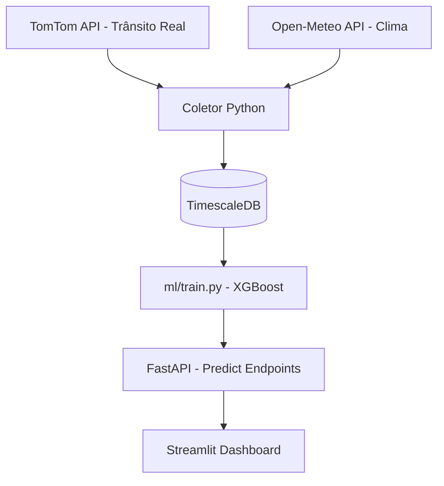

# 🚌 Mobilidade JP — Monitoramento e Predição de Tráfego em JP

> Sistema de Inteligência Artificial para prever gargalos de mobilidade em João Pessoa, PB.
> O projeto utiliza a **TomTom Traffic API** para capturar tráfego real e o **Open-Meteo** para clima, 
> treinando um modelo **XGBoost** para antecipar atrasos críticos nos principais corredores da cidade.


---

## 📌 O problema

João Pessoa possui gargalos geográficos e climáticos: o corredor Sul–Centro concentra o fluxo, e chuvas litorâneas intensas alteram drasticamente o deslocamento. Este sistema combina dados de tempo real para prever se uma rota terá atraso severo nos próximos 15 minutos.

---

## 🆓 APIs Utilizadas (100% Gratuitas)

| API | Finalidade | Limite Grátis | Chave? |
|-----|------------|---------------|--------|
| [TomTom Traffic](https://developer.tomtom.com/) | Tráfego Real e Roteamento | 2.500 req/dia | ✅ Sim |
| [Open-Meteo](https://open-meteo.com) | Clima (Chuva/Temp) | 10.000 req/dia | ❌ Não |

---

## 🏗️ Arquitetura



---

## 🗺️ Rotas Monitoradas (João Pessoa)

1.  **Mangabeira Shopping → Centro**: Principal corredor Sul-Centro.
2.  **Av. Epitácio Pessoa → Centro**: Fluxo orla e comercial.
3.  **BR-230 → Mangabeira**: Entrada de carga e fluxo intermunicipal.
4.  **Altiplano → Centro**: Fluxo zona leste.
5.  **Bessa → Centro**: Fluxo zona norte.

---

## 🚀 Como Rodar (Localmente)

### 1. Pré-requisitos
- Docker e Docker Compose instalados.
- Uma chave (API Key) gratuita da [TomTom Developers](https://developer.tomtom.com/).

### 2. Configuração
Crie um arquivo `.env` na raiz do projeto (use o `.env.example` como base):
```bash
TOMTOM_API_KEY=sua_chave_aqui
```

### 3. Subir o Sistema
O projeto é totalmente conteinerizado. Basta rodar:
```bash
docker compose up --build
```
Isso iniciará:
- **Banco de Dados (TimescaleDB)** na porta `5432`.
- **Coletor de Dados** (roda automaticamente a cada 15 min).
- **API de Previsão** na porta `8000`.
- **Dashboard** na porta `8501`.

### 4. Visualizar
Acesse o painel em: **[http://localhost:8501](http://localhost:8501)**

---

## 📊 Treinamento da IA

O sistema já vem com uma massa de dados sintéticos para calibração inicial. Para treinar o modelo com os dados capturados:
```bash
# Execute o treinamento via Docker (não precisa instalar nada local)
docker compose exec api python ml/train.py
```
*O modelo será salvo em `ml/model.pkl` e carregado automaticamente pela API.*

---

## ⚠️ Nota sobre Dados Sintéticos
O script `generate_synthetic_data.py` é incluído para permitir a visualização imediata do dashboard. Para um ambiente de produção real, o coletor deve rodar por pelo menos 7 dias (um ciclo semanal completo) para que a IA aprenda os padrões orgânicos de trânsito de João Pessoa via TomTom.

---

## 👤 Autor

---

## 📁 Estrutura do Projeto

```
mobilidade-jp/
├── collector/
│   ├── main.py             ← Scheduler (APScheduler)
│   └── apis/
│       ├── traffic.py      ← TomTom Traffic API
│       └── weather.py      ← Open-Meteo API
├── ml/
│   ├── features.py         ← Feature Engineering
│   ├── train.py            ← Treino XGBoost
│   └── predict.py          ← Inferência
├── api/
│   └── main.py             ← FastAPI REST
└── dashboard/
    └── app.py              ← Streamlit UI
```

---